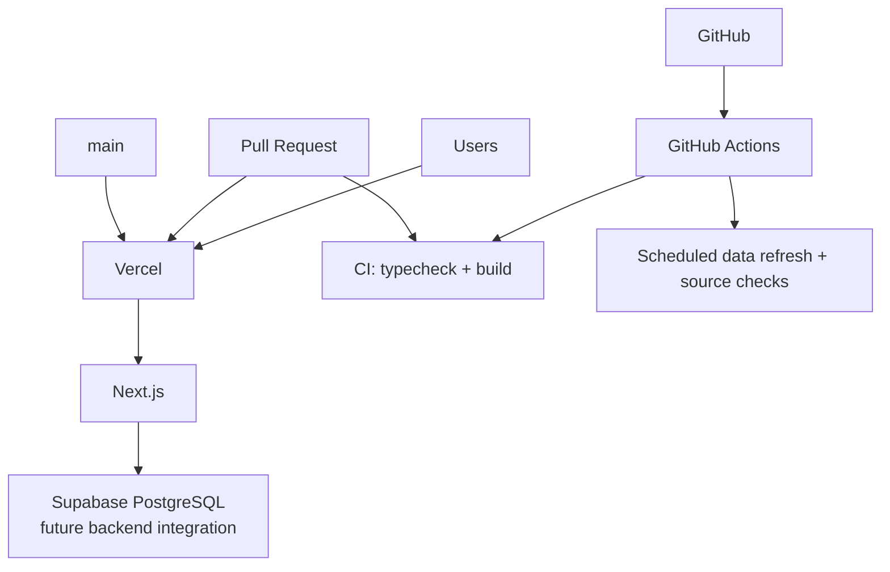

# Cloud architecture

The infrastructure stays intentionally small.

## Responsibilities

- **GitHub:** source control, branches, pull requests and review.
- **GitHub Actions:** deterministic CI and controlled maintenance/data-refresh jobs.
- **Vercel:** Next.js preview and production deployments.
- **Next.js:** application runtime and future server/API integration.
- **Supabase PostgreSQL:** future application data layer owned by the backend/data teammate.

## Trust boundaries

Browser-visible variables must use the `NEXT_PUBLIC_` convention. Server-only credentials, especially a future Supabase service-role key, must remain on the server.

Preview deployments are separate from production operationally and should use preview-safe data/credentials.
